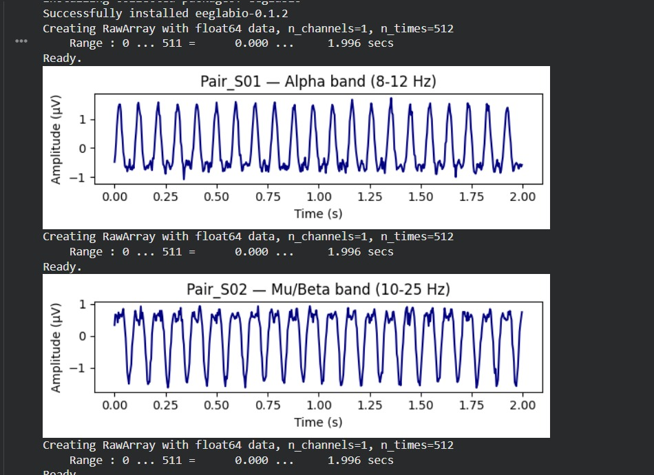
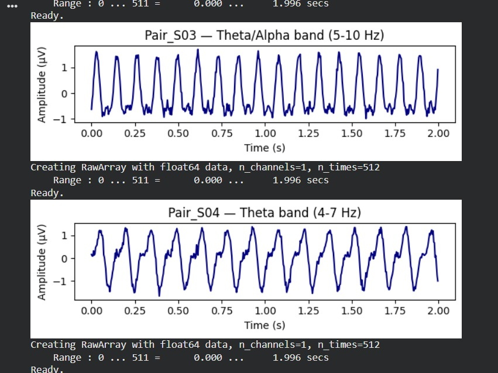
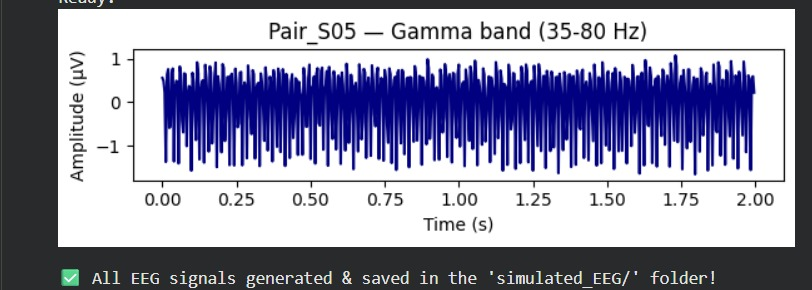
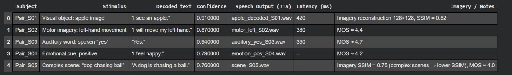

##  SNIPER CEREBRIX: A Hyperadaptive Cognition Interface

SNIPER CEREBRIX is an advanced multimodal brain decoding framework designed to interpret human cognitive states by integrating Electroencephalography (EEG) and Functional Magnetic Resonance Imaging (fMRI) data. The system combines Machine Learning, Deep Learning, and Domain Adaptation techniques to overcome the limitations of unimodal brain decoding approaches.

Unlike traditional systems that rely on a single modality, this framework leverages EEG’s high temporal resolution and fMRI’s superior spatial resolution to create a unified spatiotemporal representation of brain activity. This enables accurate decoding of complex mental states such as visual perception, mental imagery, motor intentions, and emotional responses.

---

##  Objective

The primary goal of SNIPER CEREBRIX is to develop a non-invasive, intelligent brain decoding interface capable of translating human thoughts into meaningful digital outputs. By combining multimodal data and adaptive learning, the system aims to enable real-time, accurate, and scalable brain–computer interaction.

---

## Key Features

*  **Multimodal Fusion**
  Combines EEG and fMRI signals to capture both temporal and spatial brain dynamics.

*  **Deep Learning Architecture**
  Uses Convolutional Neural Networks (CNNs) and Transformer-based cross-attention models for feature extraction and fusion.

*  **Domain Adaptation**
  Implements techniques like Domain-Aligned Interpolation (DAI) and Regularized Transfer Learning with Classifier Adaptation (RTLC) to reduce domain shift and improve generalization.

*  **Cognitive State Decoding**
  Decodes brain signals into meaningful outputs such as perception, imagery, and motor actions.

*  **Output Generation**
  Converts decoded signals into text, speech, or reconstructed imagery.

---

##  System Architecture

The system follows a structured pipeline:

1. **Data Acquisition**
   EEG and fMRI data are collected from open-source datasets simulating perception, imagery, and motor tasks.

2. **Preprocessing**

   * EEG: Filtering, artifact removal, segmentation
   * fMRI: Motion correction, normalization, ROI extraction

3. **Feature Extraction**

   * EEG: Temporal and frequency-based features using CNNs
   * fMRI: Spatial voxel-based features using 3D CNNs

4. **Domain Alignment**
   Aligns EEG and fMRI data distributions using domain adaptation techniques.

5. **Cross-Modal Fusion**
   Transformer-based attention mechanisms combine both modalities into a shared latent representation.

6. **Decoding Module**
   Translates fused features into outputs such as text, images, or speech.

---

##  Technologies Used

* Python
* TensorFlow / PyTorch
* Scikit-learn
* MNE-Python (EEG processing)
* NiLearn / NiBabel (fMRI processing)
* MATLAB / EEGLAB
* Data visualization libraries (NumPy, Pandas, Matplotlib)

---

##  Applications

* Brain–Computer Interfaces (BCI)
* Assistive communication for paralyzed patients
* Neuro-rehabilitation systems
* Cognitive state monitoring
* Human–AI interaction systems

---

##  Results & Performance

1. Performance Improvement (DA Methods)   
Example:
Baseline: 0.52
Improved (RTLC): 0.65

2. EEG Classification Results
Best models: SVM & KNN
Accuracy:
BCIC-IV-2a → ~81%
SMR-BCI → ~76%
OpenBMI → ~68%

3. Final Decoded Outputs 
“I see an apple”
“I will move my left hand”
“Yes”
“I feel happy”

And:

✅ Confidence: 0.78 – 0.94

✅ Latency: ~360–420 ms

✅ SSIM & MOS used for quality evaluation

4. Output Formats 
📝 Text output → decoded thoughts
🔊 Audio output (.wav files) → via TTS
🖼 Imagery output (128×128 images) → reconstructed visuals

## Output Samples

---

##  Future Scope

* Real-time brain signal decoding using live EEG devices
* Multilingual thought-to-text translation
* Improved model generalization across diverse populations
* Integration with wearable neurotechnology
